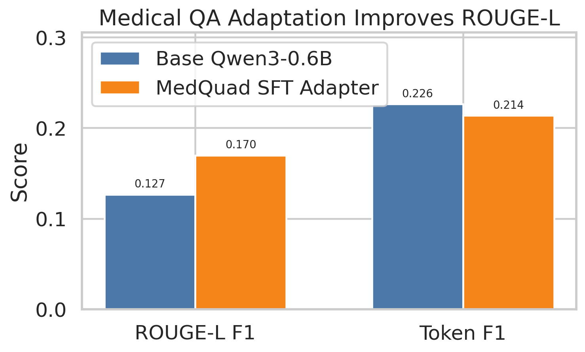
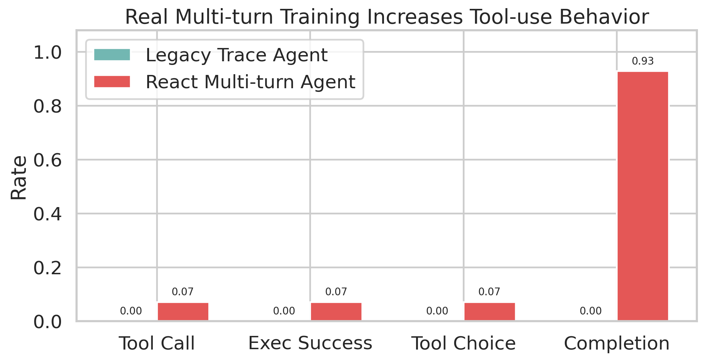
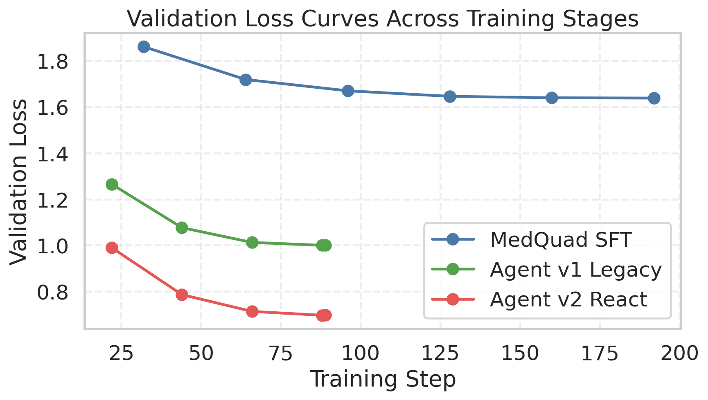
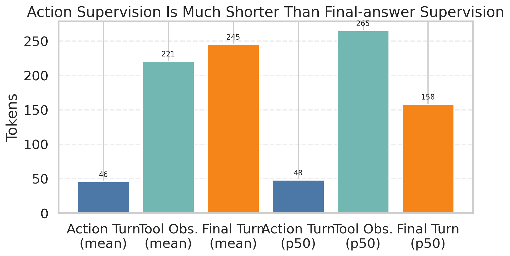

# CSC6052 NLP Assignment 3

Medical QA adaptation and tool-using agent post-training for `Qwen3-0.6B`.

This repository contains the **code needed to rebuild the project**, but intentionally **does not version large generated artifacts** such as downloaded datasets, model weights, checkpoints, local knowledge bases, course reference notebooks, or the final LaTeX report folder.

## What This Project Does

The project has two stages:

1. **Medical domain adaptation**
   - Download `keivalya/MedQuad-MedicalQnADataset`
   - Preprocess it into chat-style supervision data
   - Fine-tune `Qwen3-0.6B` with LoRA / 4-bit loading

2. **Agent post-training**
   - Build two local tools:
     - `retrieve_from_kb`
     - `calculator`
   - Generate agent supervision data
   - Compare:
     - `v1` legacy single-turn tool-trace imitation
     - `v2` real multi-turn ReAct-style training
   - Evaluate tool-use behavior, including tool call rate

## Repository Layout

Although the code files are still lightweight and script-oriented, they are organized logically by role:

| File | Purpose |
| --- | --- |
| `data_clone.py` | Download MedQuad from Hugging Face through `hf-mirror.com` |
| `model_clone.py` | Download `Qwen/Qwen3-0.6B` through `hf-mirror.com` |
| `data_process.py` | Convert raw MedQuad into chat-style medical QA SFT data |
| `train.py` | Main training entrypoint; thin wrapper around `agent_train.py` |
| `agent_train.py` | Shared LoRA / QLoRA-style training pipeline for SFT and agent post-training |
| `eval.py` | Medical QA evaluation for base model vs MedQuad adapter |
| `adapter.py` | Load base model or adapter for inference / merge |
| `vanilla_rag.py` | Build and query a local BM25-style MedQuad knowledge base |
| `tools.py` | Tool definitions and runtime execution (`retrieve_from_kb`, `calculator`) |
| `agent_config.py` | Tool schemas, agent system prompt, and output format |
| `agent_data.py` | Generate agent post-training data (`legacy_trace` and `react_multiturn`) |
| `agent_runner.py` | Run tool-calling agent loops against the local runtime |
| `agent_eval.py` | Compare agent variants, including tool call rate and completion metrics |
| `plot_results.py` | Generate result figures used in the report |
| `requirements.txt` | Python dependencies for reproducing the project |
| `assets/figures/` | Result figures exported for GitHub / README display |

## Files Intentionally Not Tracked

The following are excluded by `.gitignore` because they are large, generated, or course-template-only:

- `data/`
- `models/`
- `outputs/`
- `knowledge_base/`
- `NLP_course_Assignment_3_Template/`
- `refrence/`

If you want to reproduce the full project locally, these directories will be recreated by the scripts below.

## Environment

Recommended:

- Python `3.10+`
- CUDA-capable GPU for training / efficient evaluation
- roughly `6GB` VRAM was enough for the LoRA + 4-bit runs in this project

Install dependencies:

```bash
pip3 install --user -r requirements.txt
```

## Reproduction

Run the following from the repository root.

### 1. Download data

```bash
python3 data_clone.py
```

This will:

- set `HF_ENDPOINT=https://hf-mirror.com`
- download MedQuad
- export a local JSONL copy

### 2. Download base model

```bash
python3 model_clone.py
```

This downloads `Qwen/Qwen3-0.6B`.

### 3. Preprocess MedQuad for medical QA SFT

```bash
python3 data_process.py
```

This creates cleaned train / validation files in `data/MedQuad-MedicalQnADataset/processed/`.

### 4. Train the medical QA adapter

Example run:

```bash
python3 train.py \
  --trust-remote-code \
  --use-lora \
  --load-in-4bit \
  --gradient-checkpointing \
  --max-seq-length 768 \
  --max-train-samples 1536 \
  --max-eval-samples 64 \
  --train-batch-size 1 \
  --eval-batch-size 1 \
  --gradient-accumulation-steps 8 \
  --learning-rate 1e-4 \
  --num-train-epochs 1 \
  --output-dir ./outputs/qwen3_0.6b_medquad_lora_v2_seq768
```

### 5. Evaluate medical QA adaptation

```bash
python3 eval.py \
  --trust-remote-code \
  --load-in-4bit \
  --adapter-path ./outputs/qwen3_0.6b_medquad_lora_v2_seq768 \
  --max-samples 32 \
  --max-new-tokens 256 \
  --output-file ./outputs/medquad_eval_base_vs_adapter_v2_32.json
```

### 6. Merge the medical adapter for agent initialization

```bash
python3 adapter.py \
  --trust-remote-code \
  --adapter-path ./outputs/qwen3_0.6b_medquad_lora_v2_seq768 \
  --merge-output-dir ./models/Qwen3-0.6B-medquad-v2-merged
```

### 7. Build the local knowledge base

```bash
python3 vanilla_rag.py --build
```

### 8. Generate agent training data

Legacy trace format:

```bash
python3 agent_data.py \
  --format-version legacy_trace \
  --max-retrieve-samples 600 \
  --num-calculator-samples 120 \
  --output-dir ./data/MedQuad-MedicalQnADataset/agent_posttrain_v1
```

Real multi-turn ReAct format:

```bash
python3 agent_data.py \
  --format-version react_multiturn \
  --max-retrieve-samples 600 \
  --num-calculator-samples 120 \
  --output-dir ./data/MedQuad-MedicalQnADataset/agent_posttrain_v2_react
```

### 9. Train the two agent variants

Legacy agent:

```bash
python3 train.py \
  --trust-remote-code \
  --use-lora \
  --load-in-4bit \
  --gradient-checkpointing \
  --model-path ./models/Qwen3-0.6B-medquad-v2-merged \
  --train-file ./data/MedQuad-MedicalQnADataset/agent_posttrain_v1/agent_posttrain_train.json \
  --val-file ./data/MedQuad-MedicalQnADataset/agent_posttrain_v1/agent_posttrain_val.json \
  --max-seq-length 1024 \
  --train-batch-size 1 \
  --eval-batch-size 1 \
  --gradient-accumulation-steps 8 \
  --learning-rate 5e-5 \
  --num-train-epochs 1 \
  --logging-steps 4 \
  --save-steps 44 \
  --eval-steps 22 \
  --save-total-limit 2 \
  --output-dir ./outputs/qwen3_0.6b_agent_lora_v1
```

React multi-turn agent:

```bash
python3 train.py \
  --trust-remote-code \
  --use-lora \
  --load-in-4bit \
  --gradient-checkpointing \
  --model-path ./models/Qwen3-0.6B-medquad-v2-merged \
  --train-file ./data/MedQuad-MedicalQnADataset/agent_posttrain_v2_react/agent_posttrain_train.json \
  --val-file ./data/MedQuad-MedicalQnADataset/agent_posttrain_v2_react/agent_posttrain_val.json \
  --max-seq-length 1024 \
  --train-batch-size 1 \
  --eval-batch-size 1 \
  --gradient-accumulation-steps 8 \
  --learning-rate 5e-5 \
  --num-train-epochs 1 \
  --logging-steps 4 \
  --save-steps 44 \
  --eval-steps 22 \
  --save-total-limit 2 \
  --output-dir ./outputs/qwen3_0.6b_agent_lora_v2_react
```

### 10. Run agent evaluation

```bash
python3 agent_eval.py \
  --trust-remote-code \
  --load-in-4bit \
  --max-steps 2 \
  --max-new-tokens 96 \
  --output-file ./outputs/agent_eval_v1_vs_v2.json
```

## Main Results

### Medical QA adaptation

The MedQuad adapter improves ROUGE-L over the base model on held-out medical QA.



### Agent tool-use metrics

The real multi-turn ReAct training setup is clearly better than the legacy trace baseline under the real runtime protocol, although tool call rate is still low.



### Training curves

The multi-turn agent converges to a lower validation loss than the legacy trace agent.



### Why tool calling is still weak

The action turn is much shorter than the final-answer turn in the multi-turn training data, so the model receives much stronger supervision on “how to answer” than on “when to call a tool”.



## Current Takeaway

- Medical QA SFT works well on this small model.
- Real multi-turn agent post-training is better than legacy single-turn trace imitation.
- The current bottleneck is **low real tool-calling frequency**, not runtime integration.
- A good next step is to strengthen action-centric supervision so that the model is rewarded more strongly for calling tools before answering.

## License

The upstream GitHub repository already includes the MIT License.

## Upload Notes

If you are copying this project into an empty GitHub repository, upload the source files, `assets/`, `requirements.txt`, `README.md`, and `.gitignore`. The ignore rules are already set so that local datasets, model weights, checkpoints, report files, and reference notebooks stay out of version control.
